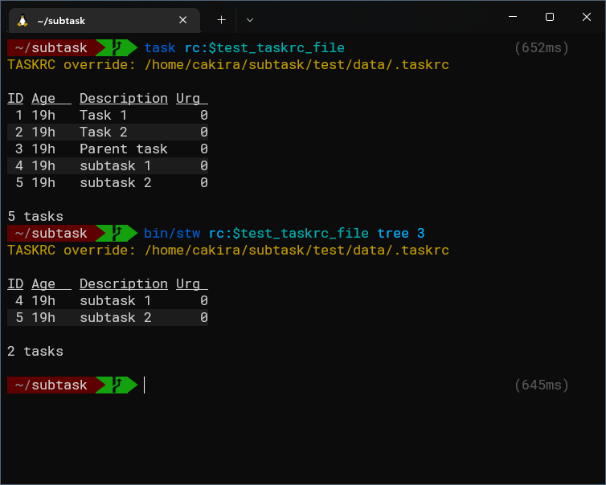

# Subtask warrior
Subtasks in Taskwarrior

## About
This is an extension to [Taskwarrior](https://taskwarrior.org/) whose
objective is to add subtasks to it.

[Taskwarrior](https://taskwarrior.org/) is a task management tool with a
command line interface.

There is an [open issue on Taskwarrior](https://github.com/GothenburgBitFactory/taskwarrior/issues/2279)
asking for subtasks, but as of May 15th 2022 no real progress in that
issue has been made.

I'm just a user of taskwarrior and not affiliated with its developers in
any way.

## Current state
It's in a very early version. All I can do it to print the subtasks of a
task (command `tree`), as seen below:



Its not possible to use the command to create subtasks yet, so the link
between the parent task and its subtasks was created manually, just for
the sake of this test.

Tested with Taskwarrior 2.6.2.

## Design
The link between the parent task and its subtasks is made through a [User
Defined Attribute](https://taskwarrior.org/docs/udas.html) (UDA) in 
Taskwarrior, named `subtasks`, with the subtasks UUIDs, as shown below.

```
task rc:$test_taskrc_file info 3
TASKRC override: /home/cakira/subtask/test/data/.taskrc

Name          Value
ID            3
Description   Parent task
Status        Pending
Entered       2022-05-15 01:44:58 (20h)
Last modified 2022-05-15 02:05:52 (19h)
Virtual tags  PENDING READY UDA UNBLOCKED
UUID          3f000090-6e51-4ab2-811e-dadc49e4c68c
Urgency          0
Subtasks      61508f-8d22-498b-90b0-b116a42dfb7a,09a2a6-54d6-48cc-b3ca-54bbea599423
```

I'm using [Grit task manager](https://github.com/climech/grit) as
inspiration for the commands.

## License
This code is released under the MIT license. For details check the
[LICENSE](LICENSE) file.

## Related projects
* [tw-subtask-sh](https://github.com/linuxcaffe/tw-subtask-sh): _"A
  taskwarrior script to create, list and invoke subtasks, which are
  maintained as task annotations."_ - Its status is pre-alpha and the
  last update was in 2016.
